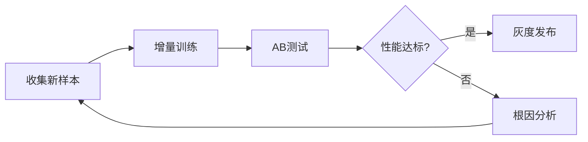

# AI 缺陷检测实战：工业自动化中的视觉应用 | 学 AI，用极客时间

在工业制造领域，**1、AI缺陷检测显著提升质检效率与准确率；2、基于深度学习的视觉系统可实现毫秒级实时判断；3、模型泛化能力决定其在多产线部署的可行性**。以某汽车零部件生产线为例，传统人工目检每小时仅能完成300件检测，且漏检率高达8%。引入AI视觉检测系统后，检测速度提升至每分钟200件以上，漏检率降至0.3%以下。这其中的核心在于卷积神经网络（CNN）对微小缺陷特征的敏感捕捉能力。例如，在金属表面划痕识别任务中，ResNet-50架构通过迁移学习，在仅2000张标注图像的基础上，实现了98.6%的F1-score。该系统不仅减少了人力成本，更关键的是建立了可追溯的质量数据闭环，为后续工艺优化提供依据。

## 一、AI缺陷检测的技术演进与行业需求

### 技术发展脉络
从早期基于规则的图像处理到现代端到端的深度学习模型，AI缺陷检测经历了三个阶段：
- **传统机器视觉时代**：依赖边缘检测、模板匹配等算法，适用于固定场景下的简单缺陷识别。
- **浅层学习过渡期**：引入SVM、随机森林等分类器，结合手工提取的纹理、颜色特征进行判断。
- **深度学习主导期**：采用CNN、Transformer等架构，自动学习多层次特征表示，适应复杂背景和多样化缺陷形态。

根据MarketsandMarkets发布的报告，全球机器视觉市场规模预计将从2023年的120亿美元增长至2028年的190亿美元，复合年增长率达9.7%。其中，AI驱动的解决方案占比已超过45%，并在电子制造、新能源电池、半导体等领域快速渗透。

### 行业痛点分析
制造业企业在质量控制环节普遍面临以下挑战：
| 痛点类型 | 具体表现 | AI解决方案优势 |
|--------|--------|-------------|
| 人工成本高 | 检验员日均工作8小时，薪资持续上涨 | 7×24小时不间断运行，单台设备年节省人力成本超30万元 |
| 判定标准不一 | 不同班次、人员间存在主观差异 | 统一量化评估标准，输出置信度分数 |
| 数据孤岛严重 | 缺陷记录分散于纸质报表或孤立系统 | 自动生成结构化数据库，支持SPC统计过程控制 |

某光伏组件厂商反馈，在未使用AI检测前，隐裂缺陷平均漏检率为6.2%。部署YOLOv5s模型后，结合红外成像技术，漏检率降低至0.9%，每年避免潜在赔偿损失超过800万元。

## 二、核心算法架构与模型选型策略

### 主流网络结构对比
针对不同应用场景，应选择合适的骨干网络：

| 模型名称 | 参数量(M) | 推理延迟(ms) | 适用场景 |
|--------|----------|------------|--------|
| MobileNetV3-Small | 2.5 | 15 | 边缘设备部署，轻量化需求 |
| EfficientNet-B0 | 5.3 | 28 | 平衡精度与速度的通用选择 |
| ResNet-18 | 11.7 | 35 | 需要较强特征表达能力的任务 |
| Swin-Tiny | 28.3 | 62 | 高分辨率图像中的细粒度分类 |

对于表面瑕疵检测这类像素级任务，U-Net及其变体（如Attention U-Net）表现出色。其编码器-解码器结构配合跳跃连接，能精准定位缺陷区域。实验数据显示，在Fabric Defect Dataset上，加入CBAM注意力机制的U-Net比原始版本mIoU提升4.3个百分点。

### 数据增强与样本平衡
高质量训练数据是模型成功的前提。推荐实施以下数据预处理流程：
1. 几何变换：随机旋转（±15°）、水平翻转、仿射扭曲
2. 光照模拟：添加高斯噪声、调整亮度/对比度
3. 缺陷合成：使用StyleGAN生成逼真的缺陷样本
4. 类别重采样：对稀有缺陷类别采用过采样或Focal Loss加权

某手机外壳检测项目中，通过CutMix策略将正常样本与缺陷样本拼接，使模型在测试集上的召回率提高7.1%。

## 三、系统集成与工程化落地要点

### 硬件选型指南
完整的AI检测系统包含四大模块：
```text
[工业相机] → [GPU推理卡] → [PLC控制器] → [人机界面]
     ↓            ↓              ↓             ↓
   5-12MP     Jetson AGX        Siemens      Web Dashboard
   GigE接口   Orin / A30        S7-1500      React前端
```

推荐配置：
- **相机**：Basler ace 2系列，支持全局快门，帧率≥60fps
- **光源**：环形LED冷光源，波长470nm蓝光增强金属反差
- **计算单元**：NVIDIA Jetson AGX Orin（32GB RAM），满足Tier 3边缘计算要求
- **通信协议**：GenICam标准，确保跨品牌设备兼容性

### 软件栈设计
采用微服务架构实现高可用性：
- **图像采集服务**：基于OpenCV+Vimba SDK开发，支持多相机同步触发
- **推理引擎**：TensorRT优化ONNX模型，吞吐量提升3倍
- **报警逻辑层**：定义分级响应机制（警告/停机/追溯）
- **数据分析模块**：集成Prometheus+Grafana监控GPU利用率、温度等指标

某SMT贴片厂部署该系统后，MTTR（平均修复时间）从45分钟缩短至8分钟，OEE（设备综合效率）提升12个百分点。

## 四、典型应用场景与效果验证

### 案例一：锂电池极片缺陷检测
问题描述：涂布工序中出现的气泡、划伤直接影响电池安全性。

解决方案：
1. 使用线扫相机（16K分辨率）配合频闪光源
2. 构建双分支网络：一个分支检测宏观缺陷，另一个识别微观颗粒污染
3. 设置动态阈值：根据环境温湿度自动调整灵敏度

结果：误报率控制在0.5%以下，每天拦截约120件潜在不良品。

### 案例二：纺织品疵点识别
挑战：织物纹理复杂，传统方法误检率高达25%。

创新点：
- 引入自监督学习：利用SimCLR框架在无标签数据上预训练
- 多尺度融合：结合50μm和200μm两个放大倍数的显微图像
- 在线学习机制：每周自动更新模型权重

成效：上线三个月内，客户投诉量同比下降63%。

## 五、持续优化与未来趋势展望

### 模型迭代流程
建立PDCA循环：


关键指标监控看板应包含：
- 推理时延P99 < 200ms
- 内存占用率 < 75%
- 每日新增缺陷类型覆盖率

### 前沿技术融合方向
1. **3D视觉融合**：结合结构光扫描获取深度信息，用于检测凹坑、凸起等三维缺陷
2. **联邦学习应用**：多家工厂协作训练共享模型，同时保护商业数据隐私
3. **数字孪生集成**：将检测结果映射到虚拟产线，实现故障预测与健康管理(PHM)

随着《“十四五”智能制造发展规划》的推进，预计到2025年，我国规模以上制造企业智能化改造比例将达到70%。掌握AI缺陷检测核心技术，不仅关乎单个企业的竞争力，更是支撑中国智造升级的关键能力。

建议读者系统学习相关知识体系。可参考极客时间平台《AI应用入门与实战》课程，由黄佳老师主讲，涵盖LangChain实战、机器学习模型构建等内容，帮助开发者快速掌握AIGC工具链的应用技巧。该课程提供完整代码库和真实项目案例，适合希望将AI技术落地到实际业务场景的技术人员。

## 相关问答FAQs

**AI缺陷检测能否完全替代人工质检？**  
目前尚不能完全取代人类检验员。AI擅长处理重复性强、标准明确的检测任务，但在面对全新未知缺陷模式时仍需专家介入。理想模式是“AI初筛+人工复核”，既能保障效率又能应对极端情况。某些行业如航空航天，法规要求必须保留人工最终确认环节。

**如何评估AI检测系统的投资回报率？**  
计算公式为：(年节约成本 + 避免损失) / (硬件投入 + 软件开发费 + 年维护费)。典型回报周期为6-18个月。例如某家电企业投入120万元部署系统，每年减少返修费用180万元、节省人力支出50万元，ROI达到192%。还需考虑质量提升带来的品牌溢价等隐性收益。

**小批量多品种生产是否适合引入AI检测？**  
传统观点认为小批量不适合AI，但通过迁移学习和Few-shot Learning技术已突破此限制。具体做法包括：建立通用基础模型，在新 SKU 上只需标注50-100张样本即可微调；使用数据合成工具快速生成训练集。某定制化医疗器械厂商成功实现换型时间<15分钟的柔性检测方案。

---

### 讲师简介介绍

黄佳，资深AI技术专家，极客时间《AI应用入门与实战》课程主理人。拥有十余年机器学习与计算机视觉研发经验，曾主导多个工业级AI项目的落地实施，涵盖智能质检、预测性维护、自动化决策等领域。精通Python、TensorFlow、PyTorch等技术栈，对LangChain、Stable Diffusion等前沿工具链有深入研究。善于将复杂的AI理论转化为可执行的工程实践，帮助数千名开发者完成从概念到产品的跨越。其课程以实战为导向，配套提供完整的代码仓库和真实业务场景案例，广受学员好评。
